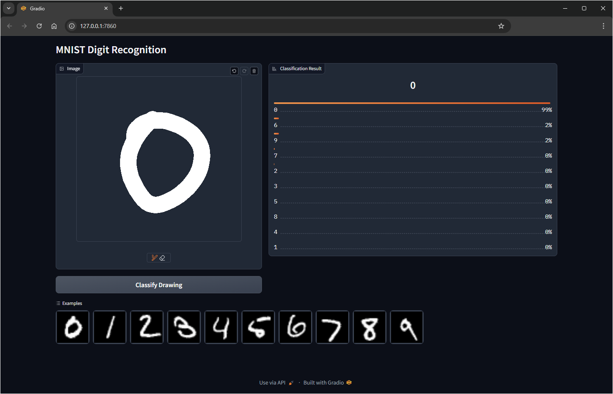

<div id="top"></div>
<br/>
<br/>

<p align="center">
  
</p>

<h1 align=center>
    <a href="https://github.com/Armaggheddon/PlainNN.cpp">PlainNN.cpp</a>
</h1>

<p align="center">
<a href="https://github.com/Armaggheddon/PlainNN.cpp/commits/main">

</a>
<a href="https://github.com/Armaggheddon/PlainNN.cpp">

</a>
<a href="https://github.com/Armaggheddon/PlainNN.cpp/issues">

</a>
<a href="https://github.com/Armaggheddon/PlainNN.cpp/blob/main/LICENSE">

</a>
<!--<a href="https://github.com/Armaggheddon/PlainNN.cpp">

</a> -->
<a href="https://colab.research.google.com/github/Armaggheddon/PlainNN.cpp/blob/main/live_demo/PlainNN_live_demo_colab.ipynb">

</a>
</p>

<p align="center">
    Neural Networks in plain C++!🎉
</p>

##
Welcome to **PlainNN.cpp**, the lightweight C++ library for building, training, and evaluating neural networks—all without the need for any external libraries! 🚀 This project is designed to be super simple, fully customizable, and perfect for anyone who loves to code deep learning from scratch.

## 💡 Project Motivation
The journey of **PlainNN.cpp** began with a simple goal: to deeply understand how the **backpropagation algorithm** works. 🚀 Initially, I created a static network implementation to tackle the **MNIST dataset**. However, as I dug deeper, the project evolved into the flexible PlainNN library we have today! 🌟

This evolution allows for custom layers, activation functions, and more—making it a powerful tool for anyone looking to explore the fascinating world of neural networks! 🧠✨

## 🌟 Features at a Glance
- 💡 **Dense Layer:** Fully connected layers right out of the box!
- ⚡ **Activation Functions:** ReLU, Sigmoid, and Softmax included!
- 📦 **MNIST/Fashion Dataloader:** Ready to load and train on classic datasets.
- 🔌 **Extensibility:** Easily create your own custom layers, activation functions, and dataloaders.
- 🚫 **No External Dependencies:** 100% plain C++—no need for extra libraries!
- 🌍 **Live Demo:** Explore a live demo through your browser!

## 🗂️ Folder Breakdown

- `data/`:<br>
    Contains all the essentials, including the MNIST dataset, the saved model, and some helpful utilities to convert PyTorch weights into a format that’s compatible with this library. Perfect for when you want to load pre-trained models or use custom weights! 🧠

- `docs/`:<br>
    Documentation for the nitty-gritty details (if you're into that 😎) and behind-the-scenes magic for the README. 😉

- `examples/`:<br>
    Looking to get started quickly? This folder has got you covered with a couple of useful examples to help you understand how to work with PlainNN.cpp. Dive in and start building! 🔧

- `live_demo/`:<br>
    Want to see the neural network in action? Head over here for the Colab live demo code. You can run the demo in your browser, draw some digits, and watch the model guess them! 🎨🖥️
    <a href="https://colab.research.google.com/github/Armaggheddon/PlainNN.cpp/blob/main/live_demo/PlainNN_live_demo_colab.ipynb"></a>

- `plain_nn/`:<br>
    This is the heart of the library, containing all the actual neural network code. If you want to dig into how things work under the hood, this is the place to explore! 💡

- `test/`:<br>
    This folder contains some tests for the image_utils wrapper around stb_image and stb_image_write. It's all about making sure the image handling is working smoothly! 🖼️✅

## 🚀 Getting Started
### 💻 Prerequisites
- A C++11 compatible compiler (g++ or clang++ will do the trick 🛠️).

### 📦 Clone the Repository
1. **Clone the Repo:**<br>
    First, clone the repository from GitHub:
    ```bash
    git clone https://github.com/Armaggheddon/PlainNN.cpp
    ```
1. **Navigate to the Project directory:**<br>
    Move into the project folder:
    ```bash
    cd PlainNN.cpp
    ```

### ⚙️ Compilation Steps
1. **Create a build directory:**<br>
    Start by creating a `build` directory to keep everything organized:
    ```bash
    mkdir -p build
    ```
1. **Navigate to the Build Directory:**<br>
    Switch to the `build` directory:
    ```bash
    cd build
    ```
1. **Generate Build Files with CMake:**<br>
    Use **CMake** to generate the build files. 🌟 If you're looking for speed, enable optimizations for a performance boost! Just keep in mind that while the code will run much faster, the compilation time will be a bit longer. ⏳💨<br>
    - For a standard build:<br>
        ```bash
        cmake ..
        ```
    - For a build with optimizations enabled:<br>
        ```bash
        cmake -DCMAKE_BUILD_TYPE=Release ..
        ```
1. **Compile the Code:**<br>
    Finally, compile the project using `make`:
    ```bash
    make
    ```

After these steps, your PlainNN.cpp library will be compiled and ready to use in the `build` folder as `libplain_nn.so`! 🎉

### 🏃‍♂️ Usage
Once compiled, dive into the `examples/` folder to see how PlainNN.cpp works. Here's a sneak peek:
```cpp
#include "plain_nn.h"
#include <iostream>

// Set up your neural network here and watch it learn 🤖
int main() {
    // Initialization, forward pass, backpropagation...
    PlainNN model;
    model.add_layer(new Input({784}));
    model.add_layer(new Dense(128, new ReLU()));
    model.add_layer(new Dense(10, new Sigmoid()));

    std::vector<double> input(784, 0.0);
    Tensor t({784}, input);
    Tensor result = model.forward(t);

    for(int i=0; i<result.size(); i++){
        std::printf("Label %d -> %.1f\n", i, result[i]);
    }
}
```

### 🌐 Running the Live Demo 
Curious to see PlainNN in action? 🎉 You can either head to the `live_demo/` folder and follow the instructions to fire up a neural network right in your browser, or check out our shared **Colab notebook** for an easy, interactive experience! 🖥️✨ It’s like magic—draw a digit, and watch the model predict it in real-time! Don’t miss out on the fun! 🎨🤖
<a href="https://colab.research.google.com/github/Armaggheddon/PlainNN.cpp/blob/main/live_demo/PlainNN_live_demo_colab.ipynb">
  
</a>

<p align="center">
  
</p>

## 🛠️ Extending PlainNN
Feeling creative? You can:

- 🧱 **Add New Layers:** Simply extend the `Layer` class and create something cool!
- 🔧 **Custom Activation Functions:** Roll your own activation functions by implementing the `ActivationFn` interface.
- 📊 **Custom Dataloaders:** Need a new dataset? Add your own `DataLoader` and explore fresh data!


Check out the `examples/` folder for some inspiration on how to extend the library. Let your imagination run wild! 🧠


## 📊 Understanding the MNIST Dataset
The **MNIST dataset** is a classic benchmark in the field of machine learning, consisting of 70,000 handwritten digits (0-9). Each image is a grayscale 28x28 pixel square, making it perfect for training neural networks. The challenge is to correctly classify these digits based on the pixel values.

### Mathematical Approach
To tackle this classification problem, we employ the backpropagation algorithm, which is key to training our neural network. Here’s a brief overview:

1. **Forward Pass:** The input image is fed through the network, generating an output vector that represents the predicted probabilities for each digit.
- **Loss Calculation:** We use a loss function, like cross-entropy, to quantify the difference between the predicted probabilities and the actual labels.
- **Backward Pass:** Using the chain rule, we calculate gradients for each weight in the network. This involves:
    - Calculating the derivative of the loss with respect to each weight.
    - Updating the weights in the opposite direction of the gradient to minimize the loss.


By repeating this process over multiple epochs, the model learns to improve its predictions! 📈

### Useful links
- [How the backpropagation algorithm works](http://neuralnetworksanddeeplearning.com/chap2.html)


## 🏆 Sample Output from Training
After training our model on the MNIST dataset, you might see an output similar to the following:
```
___________________________________________________________
Layer        (Type)       Output Shape            Param #
===========================================================
input        (Input)      (784)                         0
dense        (Dense)      (128)                    100480
dense_1      (Dense)      (10)                       1290
===========================================================
Total params: 101770 (795.08 KB)
Trainable params: 101770 (795.08 KB)
Non-trainable params: 0 (0.00 B)
___________________________________________________________
Epoch 1/10
    937/937 [====================]    9s  10ms/step - Error: 0.1462 - Accuracy: 0.8594
Epoch 2/10
    937/937 [====================]    9s   9ms/step - Error: 0.0985 - Accuracy: 0.9062
Epoch 3/10
    937/937 [====================]    9s  10ms/step - Error: 0.0697 - Accuracy: 0.8750
Epoch 4/10
    937/937 [====================]    9s   9ms/step - Error: 0.0530 - Accuracy: 0.9375
Epoch 5/10
    937/937 [====================]    9s   9ms/step - Error: 0.0803 - Accuracy: 0.9375
Epoch 6/10
    937/937 [====================]    9s   9ms/step - Error: 0.0654 - Accuracy: 0.9688
Epoch 7/10
    937/937 [====================]    9s  10ms/step - Error: 0.0719 - Accuracy: 0.9219
Epoch 8/10
    937/937 [====================]    9s   9ms/step - Error: 0.0822 - Accuracy: 0.9062
Epoch 9/10
    937/937 [====================]    9s  11ms/step - Error: 0.0385 - Accuracy: 0.9844
Epoch 10/10
    937/937 [====================]    9s   9ms/step - Error: 0.0485 - Accuracy: 0.9531
10000/10000 [====================] Loss: 0.0626 - Accuracy: 0.9313 -    1s elapsed - 127us/step
Correct: 9313/10000
```

This output shows the progress of the model over epochs, with decreasing loss and increasing accuracy, reflecting its improved ability to classify handwritten digits! 🎉

> [!NOTE] 
> The weights and model architechture for epoch 6 are saved in `data/model_save/trained_model.json` and `.weights` files respectively

## ⚠️ Challenges with the MNIST Dataset
While the MNIST dataset is a fantastic starting point, there are some challenges that can arise during the live demo:

- **Misclassification of Certain Digits:** The model may struggle with digits like '4' and '9' due to their similar structures. This can lead to confusion during classification. 🔄
- **Inconsistency:** Variations in how different people write digits can introduce inconsistencies. For example, a '1' might be drawn in a way that closely resembles a '7', causing the model to misclassify. ✍️❓
- **Noise and Distortion:** If users draw too lightly or add extra strokes, the model might misinterpret the digit, leading to unexpected predictions.


Despite these challenges, the MNIST dataset is extremely important. It provides a simplified yet powerful benchmark for neural networks, helping us test models in controlled environments. However, it's crucial that datasets represent real-world scenarios as closely as possible to ensure models generalize well beyond the lab! 🌍🔬

## 📚 Libraries Used
**PlainNN.cpp** is built with pure C++, but a few handy libraries helped make the project more efficient:

- [`json.h`](https://github.com/sheredom/json.h/tree/master): Used for parsing JSON files, keeping our configuration management clean and simple. 📝🔧
- [`stb_image.h` **&** `stb_image_write.h`](https://github.com/nothings/stb/tree/master): Handle reading and writing image files. 🖼️📥

## 🤝 Contributing
We’d love to see your contributions! Found a bug? Have a feature idea? Open an issue or submit a pull request. Let’s build something awesome together! 💪

## 📄 License
This project is licensed under the MIT License, so feel free to use it, modify it, and share it. 🎉
